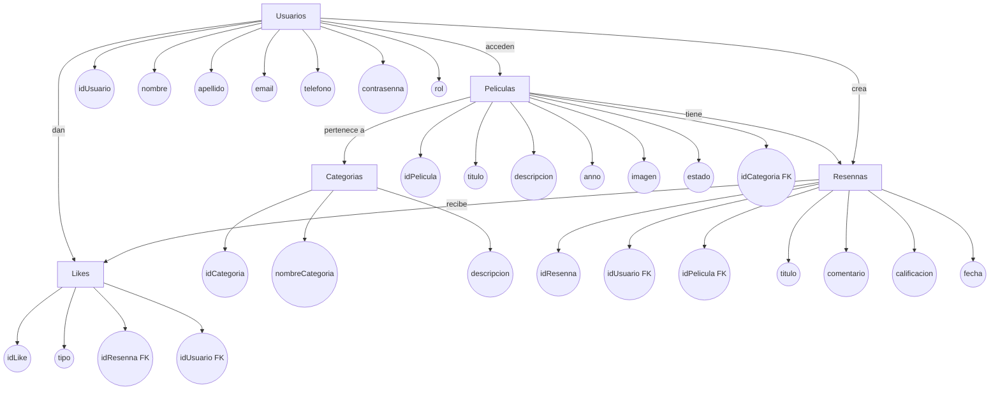
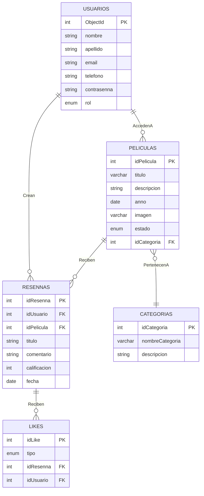

<h3 align="center";>

**Proyecto Express Backend**

</h3>

<br>
<br>
<br>

<h3 align="center";>

**Sayara Yurley Aparicio Arciniegas**

</h3>

<h3 align="center";>

**Santiago Aguilar Vesga**

</h3>

<br>
<br>
<br>
<br>

<h3 align="center";>

**S1**

</h3>

<h3 align="center";>

**Pedro Felipe Gómez Bonilla**

</h3>

<br>
<br>
<br>
<br>

<h3 align="center";>

**CAMPUSLANDS**

</h3>

<h3 align="center";>

**RUTA NODEJS**

</h3>

<h3 align="center";>

**BUCARAMANGA, SANTANDER**

</h3>

<h3 align="center";>

**2025**

</h3>

---
# KarenFlix – Backend

## Descripción del Proyecto  

**KarenFlix** es una aplicación **full-stack** con un backend desarrollado en **Node.js + Express** y un frontend independiente en **HTML + CSS + JS puro**.  

El sistema permite a los usuarios **registrarse, autenticarse, calificar, reseñar y rankear películas, series y animes geek**, mientras que los administradores gestionan categorías y validan nuevas películas.  

Este repositorio corresponde exclusivamente al **backend (API RESTful)**, que implementa autenticación con JWT, validaciones robustas, documentación con Swagger y persistencia en **MongoDB**.  

---

## Objetivo del Proyecto  

Desarrollar un backend seguro, modular y escalable que brinde los servicios necesarios para la gestión de usuarios, películas, reseñas, categorías y rankings, garantizando consistencia de datos y buenas prácticas en la arquitectura.

---

##  Características Principales  

- **Gestión de Usuarios** con roles (`usuario` y `admin`).  
- **Autenticación JWT** con `passport-jwt` y `bcrypt`.  
- **Gestión de Películas** (CRUD, aprobación por administradores).  
- **Categorías** (mínimo 4, administradas por rol `admin`).  
- **Reseñas** con calificación, comentarios y fecha.  
- **Likes/Dislikes** en reseñas (no sobre reseñas propias).  
- **Ranking ponderado** de películas.  
- **Swagger** para documentar los endpoints.  
- **Rate limiting y CORS** para seguridad.  
- **Validaciones con express-validator**.  
- **Operaciones transaccionales en MongoDB** para garantizar consistencia.  

---

## 🛠️ Tecnologías Utilizadas  

| Categoría     | Tecnología                                   | Propósito                                    |
| ------------- | -------------------------------------------- | -------------------------------------------- |
| Backend       | **Express.js**                               | Framework para la API REST                   |
| Autenticación | **passport-jwt** + **jsonwebtoken**          | Seguridad con JWT                            |
| Seguridad     | **bcrypt**, **express-rate-limit**, **cors** | Hash de contraseñas, protección de endpoints |
| Validaciones  | **express-validator**                        | Validación de datos en endpoints             |
| Base de datos | **MongoDB (driver oficial)**                 | Persistencia y transacciones                 |
| Configuración | **dotenv**                                   | Variables de entorno                         |
| Documentación | **swagger-ui-express**                       | Documentación interactiva de la API          |
| Versionado    | **semver**                                   | Versionado semántico de la API               |

---

## Estructura del Proyecto  

```bash
Proyecto_Express_Backend_AparicioSayara-AguilarSantiago/
├── src/
│   ├── config/          # Configuración de la app (DB, JWT, etc.)
│   ├── controllers/     # Lógica de negocio
│   ├── middlewares/     # Validaciones, autenticación, seguridad
│   ├── models/          # Modelos de datos
│   ├── routes/          # Definición de endpoints
│   │   ├── userRoutes.js
│   │   └── movieRoutes.js
│   ├── services/        # Servicios auxiliares
│   ├── utils/           # Funciones utilitarias
│   └── app.js           # Configuración principal Express
├── package.json
├── .env.example
└── README.md
```

---

## Instalación y Configuración  

### 1. Clonar el repositorio  

```bash
git clone <https://github.com/Santiagoaghhh/Proyecto_Express_Backend_AparicioSayara-AguilarSantiago>
cd Proyecto_Express_Backend_AparicioSayara-AguilarSantiago
```

### 2. Instalar dependencias  

```bash
npm install
```

### 3. Configurar variables de entorno  

Crear un archivo `.env` con:  

```env
PORT=3000
MONGODB_URI=mongodb+srv://santaguilar17:<db_password>@cluster0.ecvalby.mongodb.net/
JWT_SECRET=""
```

### 4. Ejecutar la aplicación  

```bash
npm start
```

La API estará disponible en:  
👉 `http://localhost:3000/api/v1`  

---
## SCRUM


### Documento de Especificaciones Técnicas


- Metodología: **SCRUM**  
- Roles: Scrum Master, Product Owner, Developers  
- Herramienta de seguimiento: GitHub Projects / Trello  
- Se definieron **sprints**, **historias de usuario** y criterios de aceptación.  
- Documento completo disponible en PDF en la carpeta `/SCRUM`.  


Este proyecto incluye documentación completa con especificaciones técnicas, requerimientos funcionales y no funcionales, historias de usuario y metodología de desarrollo.

**[Visualizar Documento Completo](./Proyecto_Express-SCRUM_AparicioSayara_AguilarSantiago.docx.pdf)**


---

## Modelo Conceptual  

## Descripción  

El modelo conceptual de **KarenFlix** tiene como objetivo representar de manera fiel las entidades principales de la plataforma, garantizando la gestión de usuarios, películas, categorías, reseñas y reacciones (likes/dislikes). El diseño se centra en mantener la coherencia, escalabilidad y eficiencia de un sistema que conecta la interacción de los usuarios con el contenido multimedia.

Se partió de entidades fundamentales como **Usuarios** y **Películas**, que constituyen el eje central del sistema. Los **Usuarios** pueden acceder a películas, escribir reseñas y reaccionar a reseñas de otros mediante likes/dislikes. Cada **Película** pertenece a una **Categoría**, lo que permite la organización lógica del contenido.  

El flujo natural de la aplicación se modeló desde el registro de un usuario, la creación de reseñas y calificaciones, hasta la interacción social mediante likes. Este diseño busca no solo representar los procesos principales de la aplicación, sino también preparar la estructura para escalar con funcionalidades como rankings avanzados, gestión de roles y análisis de popularidad de películas.  

---

## Funcionalidades principales a modelar

- Gestión de usuarios con roles diferenciados (usuario y administrador).
- CRUD de películas asociadas a categorías.
- Creación de reseñas con calificación, comentario y fecha.
- Gestión de likes/dislikes sobre reseñas.
- Asociación de películas a categorías.
- Control de estados en películas (aprobada, pendiente, inactiva).

### Funcionalidades opcionales a considerar

- Ranking ponderado de películas basado en reseñas y likes/dislikes.
- Reportes de popularidad por categoría.
- Historial de actividad de usuarios.
- Moderación avanzada de reseñas y comentarios.

---

##  Gráfica del Modelo Conceptual  





Incluye las entidades:  

- **Usuarios**  
- **Películas**  
- **Categorías**  
- **Reseñas**  
- **Likes**  

Con relaciones:  

- Un usuario **crea** reseñas.  
- Un usuario **accede** a películas.  
- Una película **tiene** reseñas.  
- Una reseña **recibe** likes.  
- Un usuario **da** likes.  
- Una película **pertenece a** una categoría.  


---
## Modelo lógico

## Descripción  

El modelo lógico transforma el diseño conceptual en una estructura más formal para bases de datos, adaptada al esquema de **MongoDB**. Cada entidad conceptual se convierte en una colección con atributos definidos y tipos de datos específicos.  

Se establecen las relaciones entre colecciones mediante referencias (ObjectId), garantizando integridad y trazabilidad:  

- **Usuarios** se relacionan con reseñas y likes.  
- **Películas** se vinculan con reseñas y categorías.  
- **Reseñas** se asocian a películas y usuarios.  
- **Likes** se conectan a reseñas y usuarios.  

El **Usuario** actúa como núcleo del sistema relacional, permitiendo gestionar tanto la creación de contenido como la interacción social.  

---

##  Gráfica del Modelo Lógico




Colecciones y atributos principales:  

- **USUARIOS**  
  - ObjectId (PK)  
  - nombre, apellido, email, teléfono, contraseña  
  - rol (enum)  

- **CATEGORÍAS**  
  - idCategoria (PK)  
  - nombreCategoria, descripción  

- **PELÍCULAS**  
  - idPelicula (PK)  
  - título, descripción, año, imagen, estado (enum)  
  - idCategoria (FK)  

- **RESEÑAS**  
  - idResenna (PK)  
  - idUsuario (FK), idPelicula (FK)  
  - título, comentario, calificación, fecha  

- **LIKES**  
  - idLike (PK)  
  - tipo (like/dislike)  
  - idResenna (FK), idUsuario (FK)  

Relaciones:  

- Usuarios **crean** reseñas.  
- Usuarios **acceden a** películas.  
- Películas **reciben** reseñas.  
- Películas **pertenecen a** categorías.  
- Reseñas **reciben** likes.  
 

---

## Descripción Técnica  

- Uso de **ObjectId** como clave primaria en usuarios y referencias cruzadas.  
- Relaciones **uno a muchos** implementadas con referencias (ejemplo: un usuario puede tener muchas reseñas).  
- Relaciones **uno a uno** entre película y categoría.  
- Campos de auditoría y estados en películas para facilitar la moderación y control.  
- Tipos de datos ajustados a MongoDB: `string`, `date`, `enum`, `int`.  
- Preparado para consultas eficientes y extensibilidad (ej. ranking de películas o reportes).  
 
---


## Endpoints Principales  

- **GET /** → Bienvenida (`"🚀 Bienvenido a la API de KarenFlix"`)  
- **/api/v1/users** → Registro, login, gestión de usuarios  
- **/api/v1/movies** → CRUD de películas  
- **/api/v1/categories** → CRUD de categorías (admin)  
- **/api/v1/reviews** → Crear, editar, eliminar reseñas  
- **/api/v1/likes** → Dar/Quitar like o dislike a reseñas  

 Documentación completa en **Swagger**:  
 `http://localhost:3000/api-docs`  


---


## **Contribuciones**

### **Sayara Aparicio (FrontEnd Developer)**  
Sayara fue la responsable del **desarrollo del FrontEnd** de KarenFlix, creando una interfaz amigable y **responsive** con **HTML, CSS y JavaScript puro**.  
Diseñó y programó las pantallas principales: **Inicio, Registro/Login, Listado de películas, Detalle de película y Panel de administrador**, asegurando que consumieran de manera correcta los **endpoints del backend**.  
También se encargó de la **validación visual de datos**, mostrando mensajes claros de error y éxito provenientes de las respuestas del servidor.  
Su trabajo garantizó una experiencia de usuario clara, fluida y adaptable a distintos dispositivos.  

### **Santiago Aguilar (Backend Developer)**  
Santiago fue el encargado de la **implementación del Backend** en **Node.js con Express**, estructurando la arquitectura modular del proyecto (**models, controllers, routes, middlewares, services, config, utils**).  
Implementó la **gestión de usuarios**, la **gestión de películas/series**, el **sistema de reseñas con ratings y likes/dislikes**, y el cálculo del **ranking ponderado**.  
Aseguró una **autenticación robusta con JWT**, la correcta aplicación de **validaciones con express-validator** y la **seguridad** mediante bcrypt, express-rate-limit y passport-jwt.  
Además, gestionó la **persistencia de datos en MongoDB** con transacciones para operaciones críticas y documentó los endpoints con **Swagger**.  

### **En conclusión...**  
Ambas partes colaboraron enorme y activamente en la realización del proyecto.  
Hubo profesionalismo por ambos lados para poder crear este proyecto **totalmente funcional**.

---

##  Sustentación del Proyecto

[](https://drive.google.com/drive/folders/1jiOGGWNO4sI5h1MfRMJGW91qCjOzU5D7?usp=sharing)
[](https://github.com/SayaraAparicio/Proyecto_Express_FrontEnd_AparicioSayara_AguilarSantiago.git)

Aquí se encuentra la sustentación del proyecto **KarenFlix**, desarrollado con **Node.js + Express** para el backend y **HTML, CSS y JavaScript puro** para el frontend.  
En esta sustentación se explican los **requerimientos**, los **patrones y principios aplicados**, así como la **implementación** y las **funcionalidades clave**: gestión de usuarios, películas/series, reseñas, categorías y rankings.


---

# Desarrollado por

- Santiago Aguilar - [Linkedin](https://www.linkedin.com/in/santiago-aguilar-208b38348/) - [GitHub](https://github.com/Santiagoaghhh) 

- Sayara Aparicio - [LinkedIn](https://www.linkedin.com/in/sayara-aparicio-38827b373/) - [GitHub](https://github.com/SayaraAparicio/)


---


